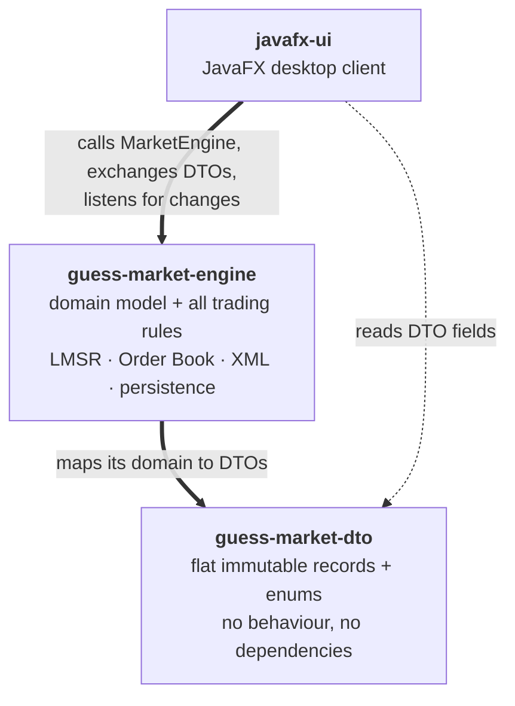
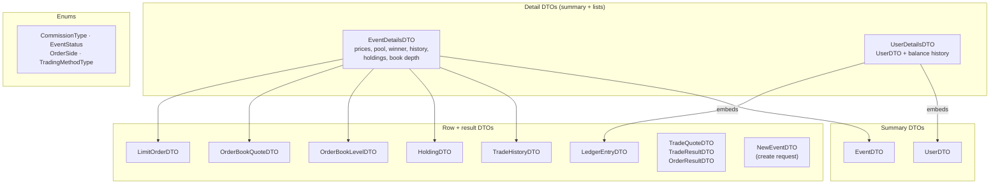
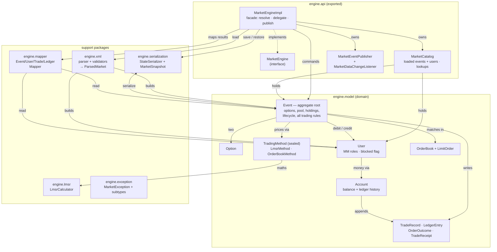
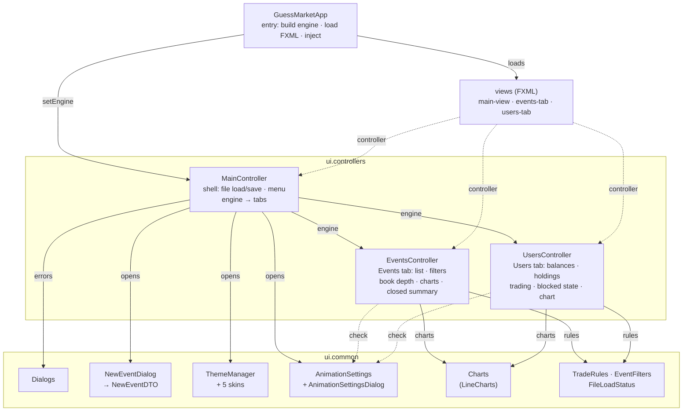

# Guess Market — architecture

Mid/high-level design: the three modules, and the classes and relationships
inside each one. Rendered images are in `docs/diagrams/` (`*.png`, `*.svg`); the
Mermaid sources (`*.mmd`) are inlined below.

The build is one Maven reactor with a strict one-way dependency
`javafx-ui → guess-market-engine → guess-market-dto`, enforced by `module-info`.

---

## 1. Modules

The UI never sees a domain object: it calls `MarketEngine` with DTOs, renders the
DTOs it gets back, and re-pulls everything when the engine fires a change event.

---

## 2. `guess-market-dto`

Every DTO is a flat, immutable `record`. A summary DTO (`EventDTO`, `UserDTO`) is
what tables show and what the UI passes back as a command argument; a detail DTO
embeds its summary DTO plus the heavy lists. `EventDTO` and `UserDTO` never
reference each other — they cross-link by id / name.

---

## 3. `guess-market-engine`

`MarketEngineImpl` owns no rules: it looks objects up in `MarketCatalog`, tells
the **`Event` aggregate** to do the work (every trading and lifecycle rule lives
there), runs the result through a `*Mapper`, and fires `MarketEventPublisher`.
`TradingMethod` is the one polymorphic seam for LMSR-vs-Order-Book behaviour.
Money moves only through `Account`, which keeps the balance-over-time ledger. XML
load and Java-serialization restore are the only two ways a whole market graph
enters the catalog.

---

## 4. `javafx-ui`

`GuessMarketApp` boots one `MarketEngineImpl` and the main window;
`MainController` injects that engine into the two tab controllers, which register
as `MarketDataChangeListener`s and re-render on every change. All bonuses live in
`ui.common`: `ThemeManager` (skins), `AnimationSettings` (toggles), `Charts`
(graphs), `NewEventDialog` (create-event).
