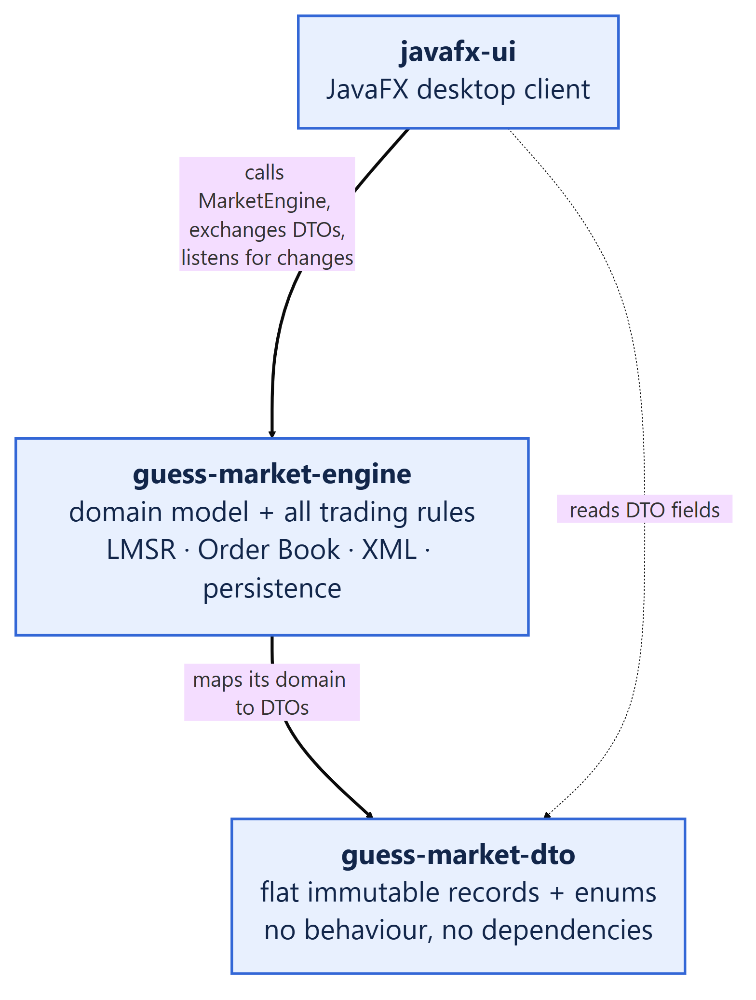
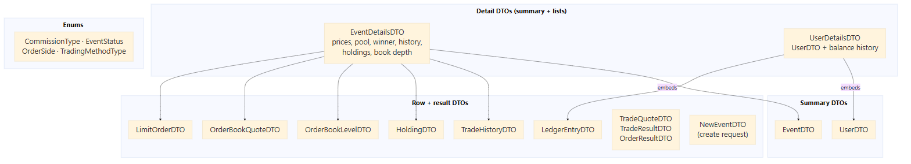
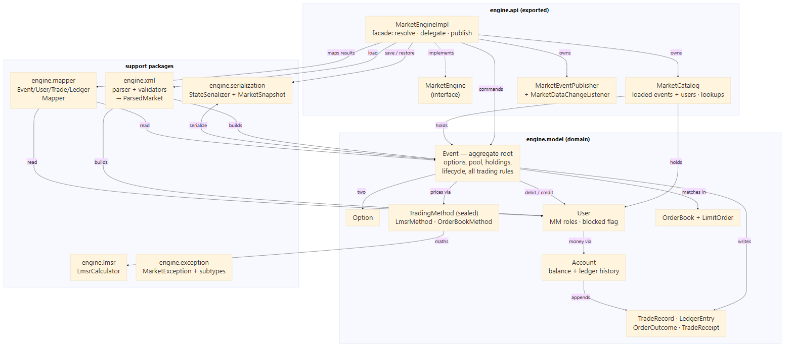
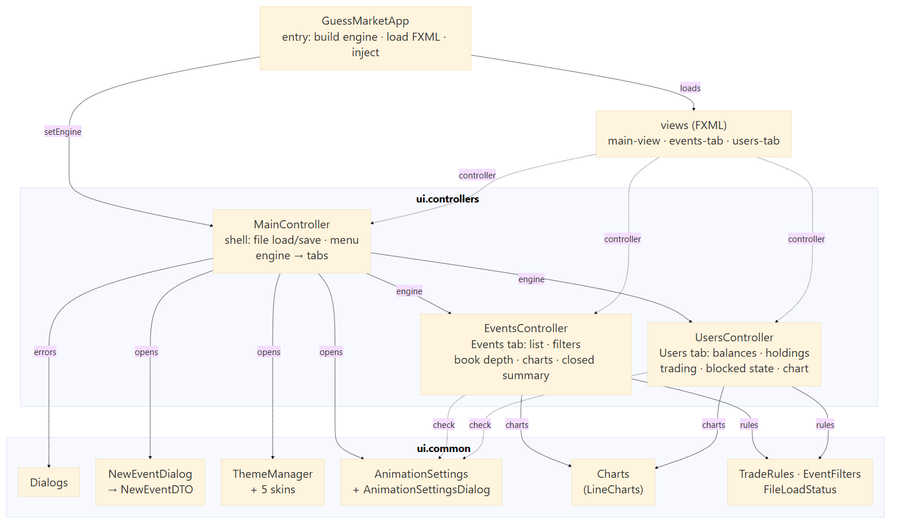

# Guess Market

A prediction-market platform. Users trade shares in binary outcomes, priced by
one of two trading methods per event: the **Logarithmic Market Scoring Rule
(LMSR)**, an automated market maker that sets prices from demand, or **Order
Book**, a peer-to-peer public book of limit orders (Polymarket-style). An
event's market maker posts a subsidy (and, for Order Book, an initial share
allocation) to open it, traders buy shares, and on settlement the holders of
the winning option are paid.

## Modules

The build is a single Maven reactor. Dependency direction is one-way:
`javafx-ui → guess-market-engine → guess-market-dto`, enforced by module-info.

| Module | Contents |
|---|---|
| `guess-market-dto` | Immutable record DTOs crossing the engine's API boundary. No dependencies. |
| `guess-market-engine` | Domain model, LMSR pricing, XML loading, state persistence. The only exported package is `com.guessmarket.engine.api`. |
| `javafx-ui` | JavaFX desktop front-end. Talks only to `engine.api` + the DTOs. |

## Build & run

```bash
mvn clean verify              # compile + test all modules
mvn -pl javafx-ui javafx:run  # launch the desktop app
```

Requires JDK 25. IntelliJ: open the root `pom.xml` as a project.

> If your machine runs antivirus HTTPS/TLS scanning (e.g. AVG), Maven on the
> command line may fail to validate `repo.maven.apache.org`. Point it at a
> truststore that includes the scanner's root CA, or use the IDE's Maven, which
> is usually already configured.

## Repository structure and diagrams

The project is split into three modules with strict layering, shown below.
For the full write-up these diagrams are drawn from, see `README_Exercise2.html`
or `README_Exercise2.pdf` in the repo root.

### Modules

`javafx-ui` calls `guess-market-engine`, which maps its domain to DTOs;
`javafx-ui` reads only DTO fields, never engine internals directly.



### `guess-market-dto`

Flat, immutable record DTOs (plus a few enums) with no behaviour and no
dependencies — the only thing that crosses the engine/UI boundary.



### `guess-market-engine`

`Event` is the aggregate root, holding options, trading method, users and
trade/ledger history; `MarketEngineImpl` is the thin facade exposed as
`engine.api`, backed by the model, LMSR, XML and serialization support
packages.



### `javafx-ui`

`GuessMarketApp` builds the engine and wires `MainController`, which hosts
the `EventsController`/`UsersController` tabs and shared `ui.common` helpers
(dialogs, charts, theming, trade rules).



## Domain model

`Event` is the aggregate root. It owns its options, cash pool, commission terms,
trade history, participants and their holdings, and enforces every rule about
them — there are no plain setters.

Workflow states:

NOT_ACTIVE --open(marketMaker)--> ACTIVE --settleAndClose(winner)--> CLOSED

- `open(User marketMaker)` — verifies the user is the event's market maker and
  can fund the trading-method subsidy, debits it into the pool, activates.
- `buy(User, optionIndex, quantity)` — for LMSR: prices via the trading method,
  charges on-purchase commission if configured, debits the buyer *first*
  (an unaffordable trade throws before anything else changes), issues
  shares, records the holding and the trade. For Order Book this is a market
  order: it may fill for less than requested.
- `settleAndClose(winningOptionIndex)` — takes the on-close commission from the
  winning pot, pays each winning holder their per-share payout from the pool,
  records the winner, closes (and discards any resting Order Book orders).

`TradingMethod` is the polymorphic seam for method-specific behaviour
(`baseValue`, `initialShares`, `usesOrderBook`, `allowsMinting`, `priceOf`,
`costToBuy`, `initialSubsidy`, `validate`) — callers ask the method, never
switch on its concrete type. `priceOf`/`costToBuy` are LMSR-only; for an Order
Book event `Event` prices and trades directly against the live book instead.

Money is `double` dollars, confined to the `Account` value object on `User`
(migrating to `BigDecimal` is future work, kept local by that class).

## XML format

The engine reads markets from an XML format. Example structure:

```xml
<Guess-Market>
  <GM-events>
    <GM-event name="Coin flip">
      <id>1</id>
      <description>Will it land heads?</description>
      <commission type="on-purchase">10</commission>
      <GM-options>
        <GM-option>Heads</GM-option>
        <GM-option>Tails</GM-option>
      </GM-options>
      <GM-method>
        <GM-LMSR><b>100</b></GM-LMSR>
        <!-- or -->
        <!-- <GM-order-book d="1" initial="100" allow-mint="true"/> -->
      </GM-method>
    </GM-event>
  </GM-events>
  <GM-users>
    <GM-user name="alice">
      <initial-cash>1000</initial-cash>
      <GM-market-maker><event id="1"/></GM-market-maker>
    </GM-user>
    <GM-user name="bob"><initial-cash>500</initial-cash></GM-user>
  </GM-users>
</Guess-Market>
```

Validation includes unique event ids, exactly two non-empty options, commission
0–90, a single valid trading method, unique user names, non-negative cash, and
exactly one market maker per event. Reading is split across `XmlMarketReader`
(file + JAXB) and `MarketAssembler` + focused validators.

## LMSR

For a binary market with liquidity parameter `b`:

Cost      C(q0, q1) = b · ln( e^(q0/b) + e^(q1/b) )
Price     p_i       = e^(q_i/b) / Σ e^(q_j/b)
Trade     cost      = C(after) - C(before)
Subsidy   C(0, 0)   = b · ln 2

`LmsrCalculator` uses a max-shift inside `exp()` to stay numerically stable for
large share counts.

## Order Book

A peer-to-peer limit-order market instead of a formula: every option has its
own independent book of resting bids/asks (`OrderBook`, one per option index,
each side kept in strict price-then-time priority). Every YES+NO pair is
always worth exactly the configured base value `d`.

Key points:
- `d` — the base value: what a winning share pays out, and what a YES+NO
  pair is worth together.
- `initial` — pairs the market maker buys at open, `initial * d` cash, in
  exchange for `initial` shares of *each* option, which are immediately
  posted for sale as two resting asks at `d / 2`.
- `allow-mint` — whether new share pairs may be minted from matching demand.

No escrow: cash and shares move only when an order actually fills. A placed
order is validated against the placer's *current* balance/holdings; however
resting orders can become unhonourable later and matching clamps fills as
necessary.

Two ways shares come into existence:
1. Initial allocation by the market maker at open.
2. Minting when matching demand meets the conditions (order book matching may
   create new pairs and pour cash into the pool to back them).

`buyShares` on an Order Book event is a market order: it sweeps the cheapest
asks up to the requested quantity, clamped fill-by-fill, and never mints or
rests a remainder.

Commission (on-purchase or on-close) is credited straight to the market maker's
account as it's collected (not pooled).

## Key design choices & assumptions

- Layering: three modules with `module-info` declarations; the UI sees only
  `engine.api` + the DTOs. The engine's `model`, `lmsr`, `xml`, `mapper`,
  `serialization` internals are hidden behind the API.
- Immutable DTOs to prevent UI-side mutation of domain state.
- `Event` is the aggregate root; `MarketEngineImpl` delegates to it for rules.
- Money confined to `Account` (as `double` dollars). Every debit/credit appends
  a `LedgerEntry` recording the resulting balance for charting.
- Order Book has no escrow; matching performs on-fill clamping and may drop
  resting orders that cannot be honoured.
- Blocked users: a user cannot normally go negative; if their balance becomes
  negative due to other activity, a blocked flag prevents some actions.
- Binary events only: exactly two options per event.
- Created events get the next free integer id.
- Window/UI is resizable; content uses scroll panes and split panes.
- State save/load writes/reads the full object graph with Java serialization
  (offered from the File menu, separate from XML loading).

## Main classes (high level)

Highlights of primary classes and responsibilities (see code for full list):

- javafx-ui: `GuessMarketApp`, `MainController`, `EventsController`, `UsersController` — UI entry, window shell, and tab controllers.
- guess-market-engine: `MarketEngine` / `MarketEngineImpl`, `MarketCatalog`, `MarketEventPublisher`, `Event` (aggregate root), `User`, `Account`, `TradingMethod` (sealed → `LmsrMethod`, `OrderBookMethod`), `OrderBook` / `LimitOrder`, `LmsrCalculator`, `engine.xml` readers/validators and `engine.mapper` converters.
- guess-market-dto: flat record DTOs used across the API boundary (`EventDTO`, `EventDetailsDTO`, `UserDTO`, `UserDetailsDTO`, trade/ledger DTOs).

## Tests

The engine module carries a JUnit 5 suite covering the LMSR maths, XML
validation, the full Order-Book lifecycle (matching, minting, market buys,
settlement), and state round-trip serialization. Run the tests with `mvn
clean verify` or from your IDE.

## Contributing

- Build with Maven and run tests locally: `mvn clean verify`.
- Follow the layering and do not export engine internals from `com.guessmarket.engine.api`.
- Keep DTOs immutable and mappers one-way (domain → DTO).
- Prefer building engine tests from inline XML fixtures or model constructors.

## Further reading

See `CLAUDE.md` and `ARCHITECTURE.md` for repository-specific conventions and
in-depth architectural notes.
